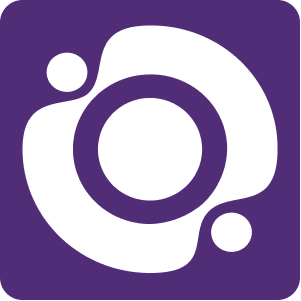

# Manual de utilizare Optizone Fleet Manager

## Introducere

Optizone Fleet Manager este o aplicație web ce permite monitorizarea și gestionarea flotelor de mașini, servere și aplicații. Acest manual prezintă funcționalitățile principale și modul de utilizare al aplicației.

## Autentificare

Pentru a accesa aplicația, trebuie să vă autentificați cu un cont valid.

1. Deschideți aplicația în browser
2. Introduceți numele de utilizator și parola
3. Apăsați butonul "Autentificare"

Notă: La prima autentificare sau după o resetare a parolei, este posibil să vi se solicite schimbarea parolei.

## Interfața principală

După autentificare, veți avea acces la interfața principală, care conține următoarele secțiuni:

1. **Meniu lateral** - pentru navigarea între diferitele funcționalități
2. **Zona de conținut** - afișează informațiile corespunzătoare secțiunii selectate
3. **Zona de notificări** - afișează mesaje importante și alerte

## Gestionare utilizatori

Această secțiune este disponibilă doar pentru utilizatorii cu rol de administrator.

### Creare utilizator nou

1. Accesați secțiunea "Gestionare utilizatori" din meniul lateral
2. Completați formularul de creare utilizator:
   - Nume utilizator (minim 3 caractere)
   - Parolă (minim 6 caractere) sau bifați opțiunea "Generează parolă aleatorie"
   - Selectați rolul: Administrator sau Utilizator
   - Opțional: Bifați "Solicită schimbarea parolei la prima autentificare"
3. Apăsați butonul "Crează utilizator"
4. După crearea utilizatorului, puteți opta pentru a trimite un email cu detaliile de autentificare

### Gestionare utilizatori existenți

Pentru fiecare utilizator, sunt disponibile următoarele acțiuni:

- **Schimbare parolă** (butonul cu iconița cheie) - Permite schimbarea parolei utilizatorului
- **Resetare parolă** (butonul cu iconița de reîmprospătare) - Generează o parolă temporară
- **Schimbare rol** (butonul cu iconița utilizator și roțiță) - Modifică rolul utilizatorului
- **Ștergere utilizator** (butonul cu iconița coș de gunoi) - Elimină utilizatorul din sistem

**Notă importantă**: Utilizatorul marcat ca "REALIZATORUL APLICAȚIEI" (cu ID-ul 1) nu poate fi modificat de alți administratori. Acesta este protejat împotriva schimbărilor de parolă, rol sau ștergere.

## Vizualizare și filtrare loguri

Această secțiune permite monitorizarea log-urilor sistemului sau ale aplicațiilor specifice.

### Filtrare loguri

1. Accesați secțiunea "Vizualizare Logs" din meniul lateral
2. Utilizați opțiunile de filtrare:
   - **Numele aplicației/serviciului** - pentru a vedea log-uri specifice
   - **Data început** și **Data sfârșit** - pentru a delimita perioada
   - **Nivelul de severitate** - pentru a filtra după tipul de mesaj (Info, Warning, Error, etc.)
   - **Cuvinte cheie** - pentru a căuta mesaje specifice
3. Apăsați butonul "Aplică filtre" pentru a actualiza rezultatele

### Modul live

Pentru a monitoriza log-urile în timp real:

1. Activați opțiunea "Mod Live"
2. Setați rata de reîmprospătare (în secunde)
3. Apăsați butonul "Pornește monitorizarea"

Pentru a opri monitorizarea în timp real, apăsați butonul "Oprește monitorizarea".

## Gestionare mașini

Această secțiune permite adăugarea și configurarea mașinilor (servere, stații de lucru) pentru monitorizare.

### Adăugare mașină nouă

1. Accesați secțiunea "Gestionare mașini" din meniul lateral
2. Completați formularul cu informațiile mașinii:
   - Numele mașinii
   - Adresa IP
   - Utilizator SSH
   - Parolă SSH sau Fișier cheie SSH
   - Descriere (opțional)
3. Apăsați butonul "Testează conexiunea" pentru a verifica accesul
4. Apăsați butonul "Adaugă mașină" pentru a finaliza

### Gestionare mașini existente

Pentru fiecare mașină, sunt disponibile următoarele acțiuni:

- **Editare** - Modifică informațiile de conectare sau descrierea
- **Testare conexiune** - Verifică dacă conexiunea SSH funcționează
- **Vizualizare loguri** - Accesează rapid log-urile de pe mașina respectivă
- **Ștergere** - Elimină mașina din sistem

## Setări utilizator

În această secțiune puteți:

1. Schimba parola personală
2. Configura preferințele de interfață
3. Seta opțiunile de notificare

Pentru a schimba parola:

1. Accesați secțiunea "Setări utilizator" din meniul principal
2. Introduceți parola actuală
3. Introduceți parola nouă (de două ori pentru confirmare)
4. Apăsați butonul "Salvează"

## Deconectare

Pentru a vă deconecta din aplicație, apăsați butonul "Deconectare" din meniul principal sau din colțul dreapta sus al interfeței.

## Rezolvarea problemelor comune

### Nu mă pot autentifica

- Verificați dacă numele de utilizator și parola sunt corecte
- Asigurați-vă că utilizați majuscule și minuscule corespunzător
- Contactați un administrator pentru resetarea parolei

### Nu pot vizualiza log-urile

- Verificați dacă mașina este configurată corect
- Asigurați-vă că conexiunea SSH funcționează
- Verificați dacă aveți permisiunile necesare pentru a citi log-urile

### Nu pot adăuga o mașină nouă

- Verificați dacă toate informațiile necesare sunt completate corect
- Asigurați-vă că adresa IP este validă și accesibilă
- Verificați dacă serviciul SSH rulează pe mașina țintă
- Confirmați că portul SSH (implicit 22) nu este blocat de firewall

### Funcția de mod live nu funcționează

- Verificați conexiunea la internet
- Asigurați-vă că browser-ul permite conexiuni WebSocket
- Măriți rata de reîmprospătare dacă log-urile nu apar suficient de rapid
- Verificați dacă serviciul generat log-uri în mod activ

## Contactare suport

Pentru asistență suplimentară:

- Email: support@optizone.com
- Telefon: 0800-123-456
- Program suport: Luni-Vineri, 09:00-17:00

